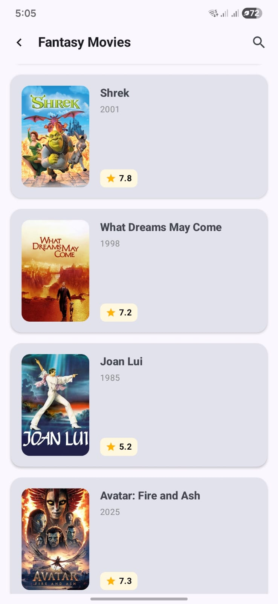

# 🎬 MovieDB Android App

MovieDB is a modern Android application developed using **Jetpack Compose** and **Kotlin**. This application allows users to explore lists of movies by genre, search for favorite movies, view in-depth details (synopsis, cast, reviews), and watch official trailers directly within the app.

## ✨ Key Features
* **Explore Genres & Movies**: Displays a list of genres and movies based on categories (using Paging 3 for *infinite scrolling*).
* **Movie Search**: Search for favorite movie titles in *real-time*.
* **Comprehensive Movie Details**: Displays posters, ratings, synopsis, metadata, cast list, and genres.
* **Integrated Trailer Player**: Plays official YouTube trailers using `AndroidView` and the YouTube Player API.
* **User Reviews**: Read user reviews of the selected movie.
* **Favorites & Watchlist**: Save movies to a favorites list for later viewing using an encrypted *local database* (SQLCipher).

## 🛠️ Tech Stack & Library

This application is built following modern Android architecture guidelines (MVVM + Clean Architecture principles):
* **UI**: [Jetpack Compose](https://developer.android.com/jetpack/compose) - Modern declarative UI toolkit.
* **Architecture**: MVVM (Model-View-ViewModel).
* **Networking**: [Ktor Client](https://ktor.io/) - Asynchronous HTTP client for fetching data from APIs.
* **Dependency Injection**: [Koin](https://insert-koin.io/) - A lightweight DI framework for Kotlin.
* **Asynchronous Programming**: Coroutines & Flow (`StateFlow`, `SharedFlow`).
* **Navigation**: Navigation Compose (`NavHost`, routing with JSON serializable arguments).
* **Pagination**: [Paging 3](https://developer.android.com/topic/libraries/architecture/paging/v3-overview) - Efficiently handles loading large data sets.
* **Serialization**: [Kotlinx Serialization](https://github.com/Kotlin/kotlinx.serialization) - Parses API JSON responses and passes data between screens.
* **Local Database**: Room & SQLCipher (for local data security).
* **Image Loading**: Coil (Compose Image Loader).
* **Media**: YouTube Android Player API - Native video player.

## 📂 Navigation Structure

Navigation is centrally managed in `AppNavHost.kt` using a *Sealed Class* system (`Screen.kt`):
1. `GenreList` ➔ Home page.
2. `MovieList` ➔ Displays movies based on the selected Genre.
3. `MovieSearch` ➔ Search page.
4. `MovieDetail` ➔ Displays full details (passes *movieId*).
5. `UserReviews` ➔ Read movie reviews (receives JSON object `MovieDetailResponse`).
6. `TrailerPlayer` ➔ Plays YouTube video (receives `videoKey`).

## 🚀 Installation & Local Setup

To run this project on your local machine:

**1. Clone this repository:**
```bash
git clone https://github.com/byansanur/moviedb-android-app.git
```

**2. Open in Android Studio:**
It is recommended to use the latest version of Android Studio (Iguana / Jellyfish or newer).

**3. Environment Variables Configuration (Mandatory):**
This application uses APIs from **The Movie Database (TMDB)** and requires a secret key for the local database.
Create a file named `local.properties` in the project's *root* folder (parallel to `build.gradle.kts`), then add the following lines with your actual credentials:

```properties
baseUrl="https://api.themoviedb.org/3/"
imageUrl="https://image.tmdb.org/t/p/"
apiKey="INSERT_TMDB_API_KEY_HERE"
accessToken="INSERT_TMDB_ACCESS_TOKEN_HERE"
dbKeySecretSha256="INSERT_YOUR_DATABASE_PASSWORD_HERE"
```

*(Note: Ensure `local.properties` is never committed to a public repository).*

**4. Build & Run:**
Sync Gradle and run the app on an Emulator or Physical Android Device.

## 🤖 Continuous Integration (CI)

This project is equipped with **GitHub Actions** that automatically compile, run *Linter/Unit Tests*, and build a **Debug APK** every time there is a *Push* or *Merge* to the main *branch*. You can download the built APK directly from the **Actions** tab in this repository.

## 📸 Screenshots

| Home / Genre | Movie List | Search | Movie Detail | Trailer Player |
| --- | --- | --- | --- | --- |
|  |  |  |  |  |

## 👨‍💻 Author

**Ratbyansa Nur** Software Engineer (Android / Java / Web)

*Made with ❤️ and Kotlin.*
